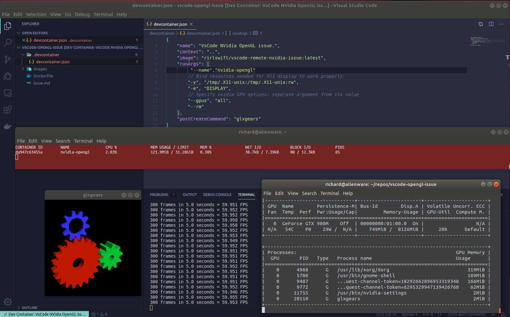

# Fix: Allow use of NVidia OpenGL within VsCode Development Container

## Summary
Separate the run argument from its value in the container json.

## Validate 
1) Open THIS issue's folder (uses included container json) in VsCode (starts container)
3) VsCode successfully starts the container and runs glgears.

