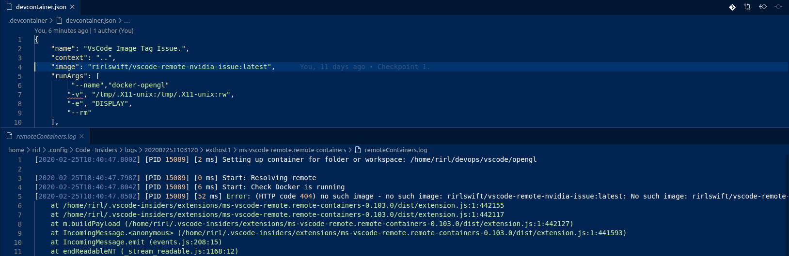

# Issue: Container image with tag specified causes a startup failure.

## Description
We would like to be able to specify a tag for the docker image in the container JSON. 
This allows us to 'pin' our development stack.
However, the tag specified on the image setting is not recognized or honored unless it is pulled before launch the container via VsCode (e.g., external pull). We are attempting to use the 'standard' Docker syntax

``` bash
"image": "rirlswift/vscode-remote-nvidia-issue:latest"
```

## Context
``` bash
# About VsCode
Version: 1.42.1
Commit: c47d83b293181d9be64f27ff093689e8e7aed054
Date: 2020-02-11T14:50:36.977Z
Electron: 6.1.6
Chrome: 76.0.3809.146
Node.js: 12.4.0
V8: 7.6.303.31-electron.0
OS: Linux x64 5.3.0-26-generic

# About Docker
docker --version
Docker version 19.03.02, build 6a30dfc
```

## Replication 
1) Open THIS issue's folder (uses included container json) in VsCode (starts container)
3) VsCode reports the following error and is unable to start the container.



:loudspeaker: The container json is referencing the publically accessible docker image Docker Hub.


## Expected results 
1) When a tag is specified for a docker image in the container JSON, VsCode should pull that specific image, and use it to start the container.

## Workaround
1) Pull the tagged docker image before running VsCode on container folders.
2) Helper script could check, pull image with tag, then start VsCode on folder using CLI.
